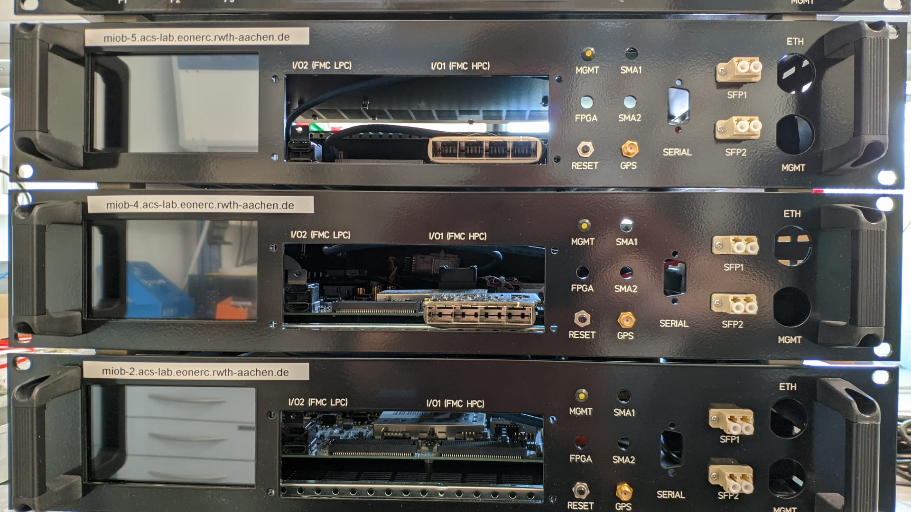
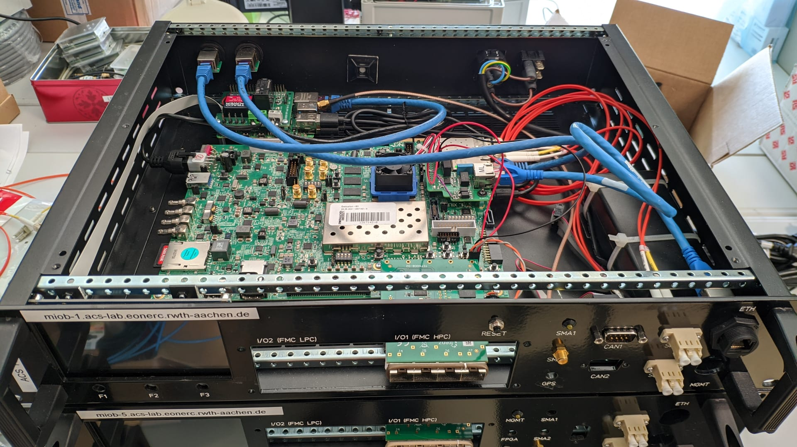

# MIOB - Mobile Input Output Box

[](https://github.com/rwth-acs/miob/blob/master/LICENSE)
<!-- [](https://github.com/rwth-acs/miob/actions) -->
<!-- [](https://zenodo.org/badge/latestdoi/413409974) -->

MIOB, the _Mobile IO Box_ is a flexible unit for interconnecting laboratory equipment and measurements.

Built around a Xilinx Ultrascale+ VC106 FPGA evaluation board, it provides both computation power and IO flexibility for various interfacing tasks in a laboratory.

This repository contains the construction drawings, bill of materials, software and general documentation for building your own MIOB.

## Documentation

- [Xilinx HWserver](./sw/hw_server/README.md)
- [Touchpanel Display](./sw/touchpanel/README.md)
  - [Kiosk Mode](./sw/kiosk/README.md)
- [VILLAScontroller](./sw/villas-controller/README.md)

## Control FPGA Power from Raspberry:

```
#Set pin as output
raspi-gpio set 24 op

#Turn off FPGA Power
raspi-gpio set 24 dh

#Turn on FPGA Power
raspi-gpio set 24 dl
```

## Access Zynq Boot Shell from Raspberry
```
sudo picocom --baud 115200 --flow n /dev/ttyUSB0
```

## Xilinx Vivado Set-up

1. Include all necessary design sources, constraints and simulation sources
    e.g. for [zcu106_aurora_dino][miob_dino]:
        - [aurora_reset][aurora_reset.vhd]
        - [axi_read_cache][axi_read_cache.vhd]
        - [config_timer][config_timer.vhd]
        - [dinoif_dac][dinoif_dac.vhd]
        - [dinoif_fast_nologic][dinoif_fast_nologic.vhd]
        - [prepend_seqnum][prepend_seqnum.vhd]
        - [registerif][registerif.vhd]
        - [dino-rev-b][dino-rev-b.xdc]

2. If available, execute Tcl file
```
    source <file.tcl>
```

3. Create HDL Wrapper
    - right-click on block design and select "Create HDL Wrapper"

4. Set as TOP
    - right-click on wrapped block design and select "Set as Top" 


## Photos




## Authors

- Niklas Eiling ([@n-eiling](https://github.com/n-eiling)), Institute for Automation of Complex Power Systems, RWTH Aachen University)
- Steffen Vogel ([@stv0g](https://github.com/stv0g), Institute for Automation of Complex Power Systems, RWTH Aachen University)

## License

The contents of this repository are licensed under the weakly-reciprocal version of the [CERN Open Hardware Licence Version 2][cern-ohl-v2]

## Funding acknowledment

 The development of [MIOB][miob] has been supported by the following projects:

-  [ERIGrid 2.0][erigrid-2] project of the H2020 Programme under [Grant Agreement No. 870620](https://cordis.europa.eu/project/id/870620)
-  [Urban Energy Lab 4.0][uel] sub-project [InFIS][uel-infis].

[miob]: https://github.com/RWTH-ACS/miob
[uel]: https://www.uel4-0.de/
[uel-infis]: https://www.uel4-0.de/Infrastruktur/Mobiler-Pruefstand/
[erigrid-2]: https://erigrid2.eu
[cern-ohl-v2]: https://ohwr.org/cern_ohl_w_v2.txt
[aurora_reset.vhd]: https://github.com/RWTH-ACS/dino/blob/main/hdl/vivado/design_src/aurora_reset.vhd
[axi_read_cache.vhd]: https://github.com/RWTH-ACS/miob/blob/main/fpga/common/axi_read_cache.vhd
[config_timer.vhd]: https://github.com/RWTH-ACS/dino/blob/main/hdl/vivado/design_src/config_timer.vhd
[dinoif_dac.vhd]: https://github.com/RWTH-ACS/dino/blob/main/hdl/vivado/design_src/dinoif_dac.vhd
[dinoif_fast_nologic.vhd]: https://github.com/RWTH-ACS/dino/blob/main/hdl/vivado/design_src/dinoif_fast_nologic.vhd
[prepend_seqnum.vhd]: https://github.com/RWTH-ACS/dino/blob/main/hdl/vivado/design_src/prepend_seqnum.vhd
[registerif.vhd]: https://github.com/RWTH-ACS/miob/blob/main/fpga/vc707_aurora_xbar/registerif.vhd
[dino-rev-b.xdc]: https://github.com/RWTH-ACS/dino/blob/main/hdl/vivado/constr/dino-rev-b.xdc
[miob_dino]: https://github.com/RWTH-ACS/miob/tree/main/fpga/zcu106_aurora_dino
